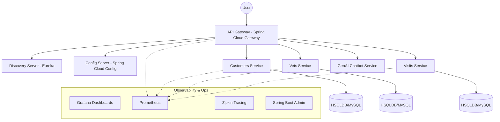
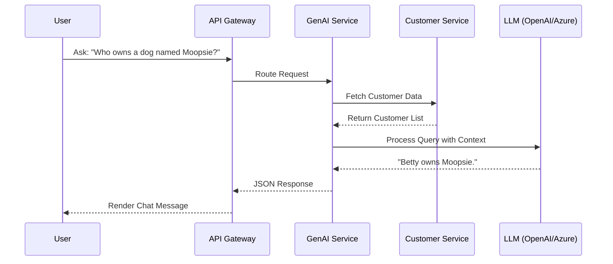

# ☁️ CloudNative: Professional Spring Cloud Microservices Blueprint


CloudNative is a production-ready demonstration of distributed systems using **Spring Boot 3** and **Spring Cloud**. It provides a complete blueprint for building, discovering, and monitoring microservices in a cloud-native environment, integrated with modern observability tools like **Grafana**, **Prometheus**, and **Micrometer**.

## 🏗️ Architectural Blueprint

The platform is designed with a decentralized approach, ensuring high availability and fault tolerance across all services.



## ⚡ Key Microservices

- **API Gateway**: Unified entry point with intelligent routing and circuit breaking.
- **Service Discovery**: Automated detection and load balancing via Netflix Eureka.
- **Centralized Config**: Externalized configuration management for all environments.
- **GenAI Service**: Advanced AI-powered chatbot for natural language interaction.
- **Observability Stack**: Full-spectrum monitoring with Micrometer and Prometheus.

## 🔄 AI Interaction Flow



## 🚀 Getting Started

### 1. Build the Artifacts
```bash
./mvnw clean install
```

### 2. Launch with Docker Compose
```bash
docker compose up -d
```

### 3. Key Access Points
- **Frontend Portal**: `http://localhost:8080`
- **Discovery Dashboard**: `http://localhost:8761`
- **Grafana Metrics**: `http://localhost:3030`
- **Config Server**: `http://localhost:8888`

## 📦 Cloud Infrastructure

The stack is fully containerized and optimized for **Kubernetes** deployment. It includes health checks and graceful shutdown procedures to ensure zero-downtime updates.

---
*Architected and Refined by Saanvi Rajput. Pioneering Cloud-Native Excellence.*
